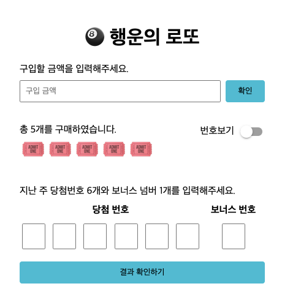

# Lotto

## 구현예시

 
 

## React를 활용한 로또 만들기 미션

로또를 React를 활용하여 구현목록을 만들고 이후 추가적인 구현을 통하여 React에 대한 깊은 이해를 가지는 것이 목표입니다.

 
 

## 공통 구현 목록

# Lotto

구현사항

- [] 로또 구입 금액을 입력하면, 금액에 해당하는 로또를 발급해야 한다.
  - [x] 로또 1장의 가격은 1,000원이다.
    - [x] 1000원이 아닌 금액이 입력되었다면 "1000000원 이하의 금액을 1000원단위로 입력해주세요"를 보여준다.
  - [x] 구입금액은 1,000,000 이하여야한다.
    - [x] 1000000 금액이 넘어간다면 "1000000원 이하의 금액을 1000원단위로 입력해주세요"를 보여준다.
  - [x] 구입금액은 "숫자만" 입력되어야한다.
    - [x] "구입금액은 숫자만 입력해주십시오"를 보여준다.
- [x] 소비자는 자동 구매만 할 수 있다.
  - [x] 구매 로또 번호는 6자리의 번호여야한다.
    - [x] 총 ~개를 구매하였습니다. 에서 ~는 구입금액 기준으로 한다.
    - [x] 각 로또 번호는 랜덤이여야하며 중복이 없어야한다.
    - [x] 각 번호는 1~45사이의 숫자여야한다.
- [] 복권 번호는 번호보기 토글 버튼을 클릭하면, 볼 수 있어야 한다.
  - [] 처음 상태는 번호가 보여지지 않는 상태여야한다.
  - [] 토글버튼을 눌렀을 때 로또 구매 번호는 변경되어서는 안된다.
- [] 결과 확인하기 버튼을 누르면 모달이 등장한다.
  - [] 모달내용은 당첨 통계, 수익률이 등장한다.
  - [] 당첨 통계는 유저의 랜덤넘버와 입력한 당첨번호를 기준으로한다.
    - [ ] userNumber, winningNumber 배열을 비교하여 일치개수를 구한다.
      - [ ] 3개가 일치한다면 당첨금은 5000원
      - [ ] 4개가 일치한다면 당첨금은 50000원
      - [ ] 5개가 일치한다면 당첨금은 150000원
      - [ ] 5개 + 보너스 번호 가 일치한다면 당첨금은 30000000 원
      - [ ] 6개가 일치한다면 당첨금은 2000000000원
    - [ ] 수익률 계산은 당첨금액 / 구입금액
- [ ] 다시 시작하기 버튼을 누르면 초기화 되서 다시 구매를 시작할 수 있다.

## How To Start?

- Boilerplate는 페어와 협의하여 자유롭게 선택합니다.
- 불필요한 Third-Party 없이 오로지 React에서 제공되는 것만으로 구현합니다.
- 테스트 도구 선정부터 작성까지 일절 관여하지 않습니다. 자유롭게 즐겨보세요.

- main
  ㄴ App
  ㄴ LottoGame
  ㄴ lotto, modal
  ㄴ 로또안: list(inpuvalue필요), puchase(inputvalue존재), winning component이 존재

모달 css 형태 visibility : hidden, opacity: 0 => 결과 확인하기를 누르면 hidden -> visible, opacity: 100
